## Работа с GitHub Desktop
0. Изтегляне на GitHub Desktop
    - Изтеглете GitHub Desktop от официалната страница на GitHub. [Download GitHub Desktop](https://desktop.github.com/download/)

      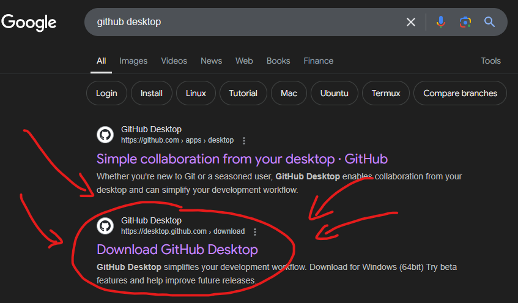
      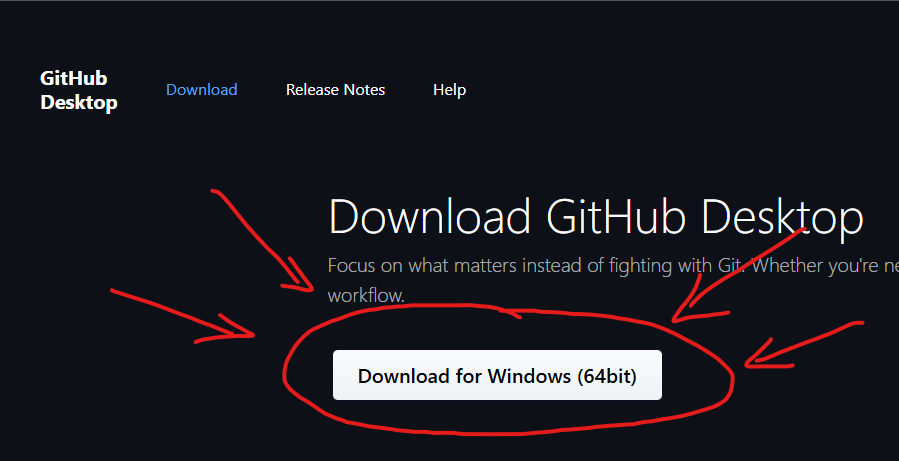
1. Настройване на GitHub Desktop
    - След инсталиране GitHub Desktop ще изисква влизане чрез GitHub акаунт.

      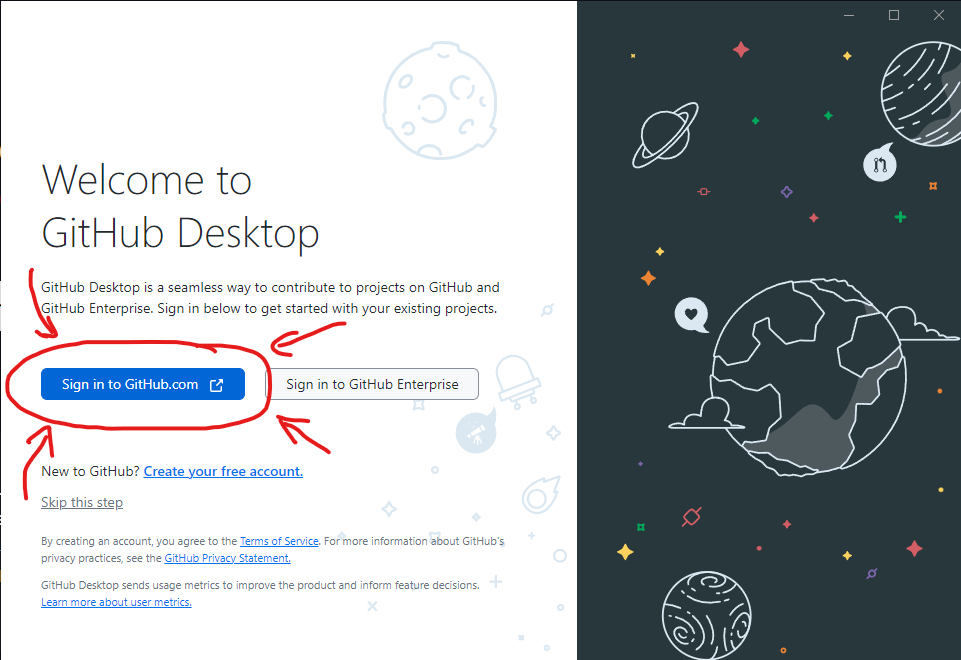
    - След натискане на **Sign in to GitHub.com** ще бъдете препратени в браузър, където трябва да посочите с кой GitHub акаунт искате да свържете GitHub Desktop.

      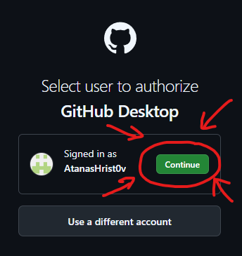
    - След потвърждение от браузъра се връщате в GitHub Desktop, за да завършите настройването. (На мястото на Email може да пише един странен дълъг имейл, сменете го с вашия си)

      
2. Клониране на repo-то
    - От списъка с repo-та изберете вашият fork на UP repo-то.
    - Натиснете clone.

      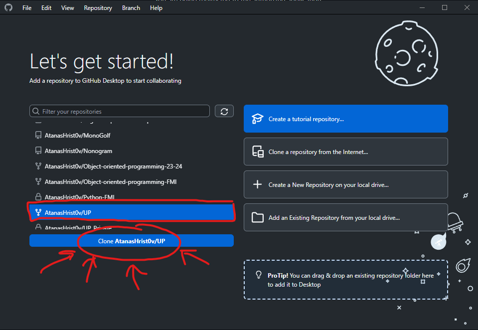
    - Ще се покаже един от двата прозореца, изобразени по-долу. Който и от двата да е, натиснете clone.

      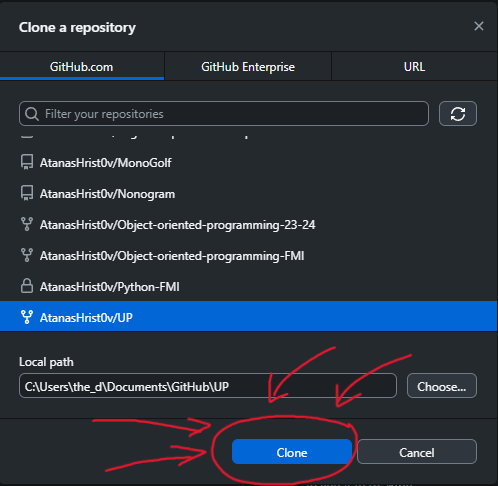
      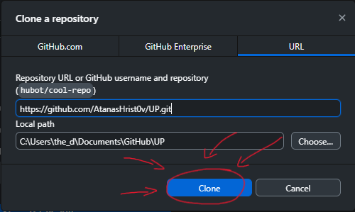
    - В следващия прозорец задължително изберете опцията **To contribute to the parent project** и натиснете **Continue**.

      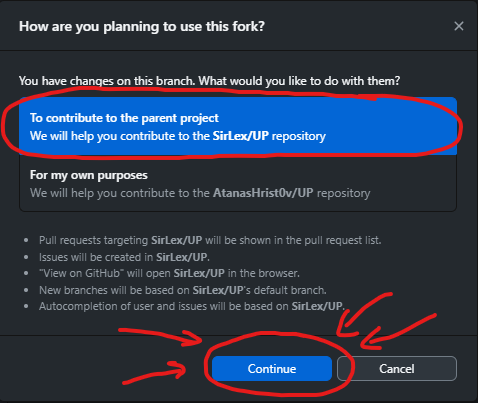
3. Fetch-ване

    
4. Създаване на клон

    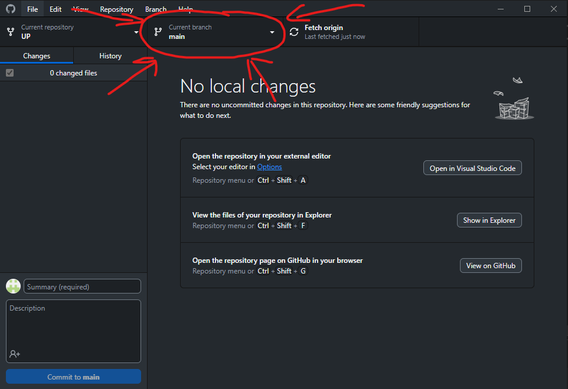
    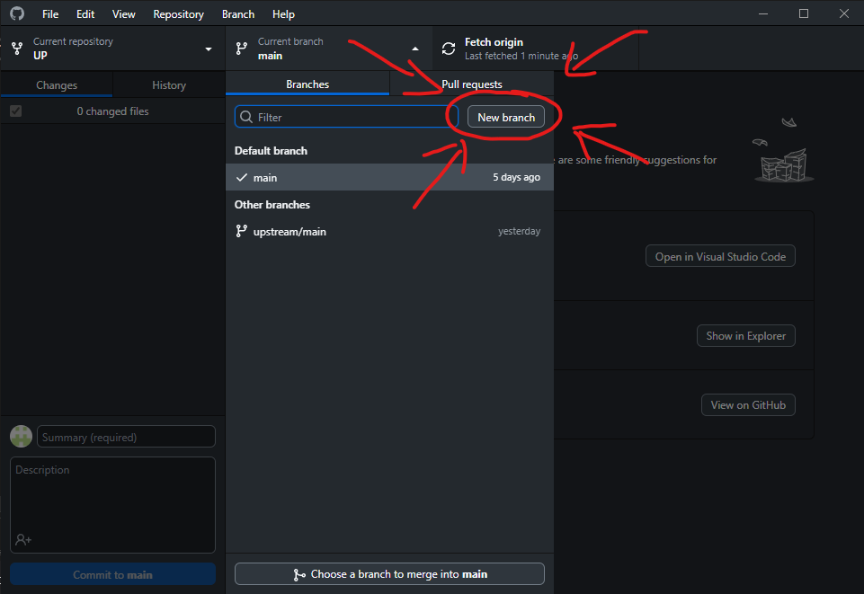
    - При създаването на клон задайте име за клона практикума, за който ще пишете задачи. (Както е показана на картинката).

      
    - Публикувайте клона към GitHub.

      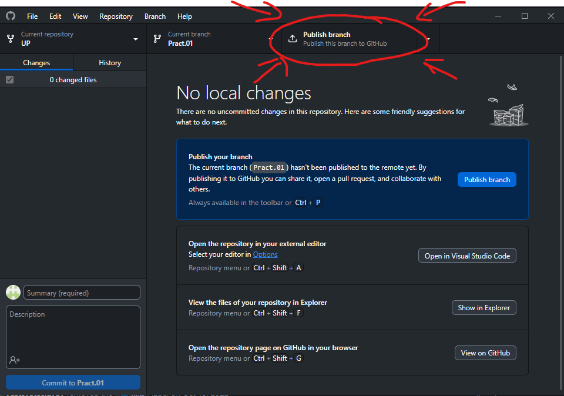
5. Добавяне на решение на задача
    - Отворете местоположението на клонираното repo-то на локалната машина.

      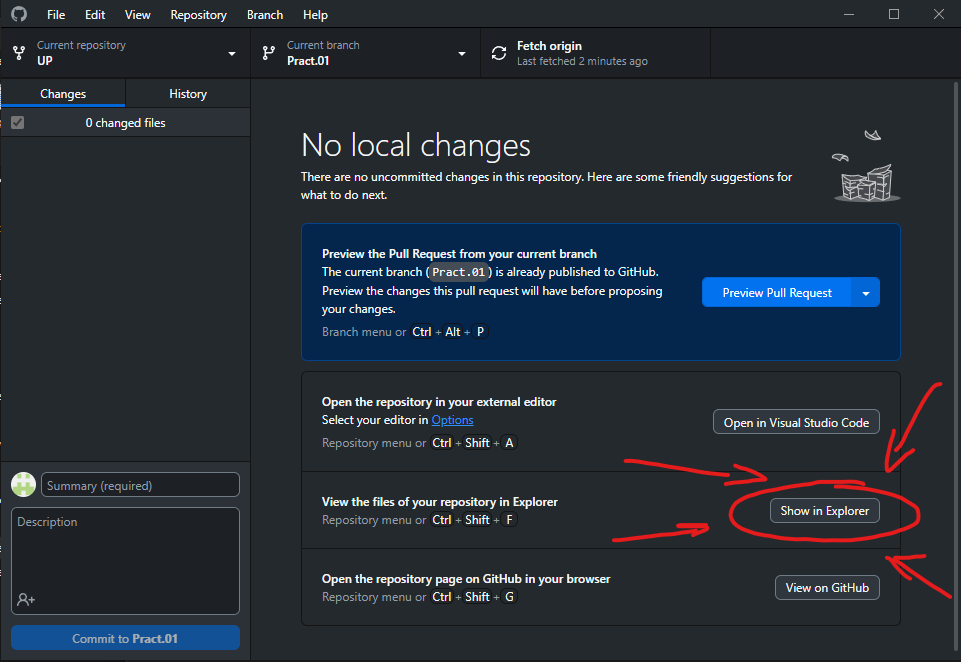
    - Ще Ви излезе този прозорец. Влезте в папката на съответния семинар и после в папката за практикум.

      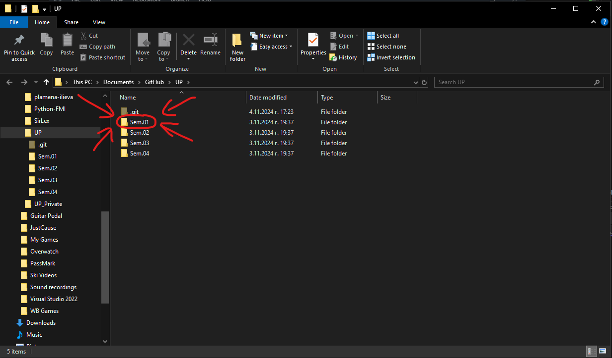
      
    - Копирайте правилно наименуваните файлове с решенията в папката за съответния практикум.<br> (Важно е да спазвате конвенцията за именуване на файлове! Ако в папката вече има файлове при копиране дайте опцията да се заместят съществуващите файлове с вашите)

      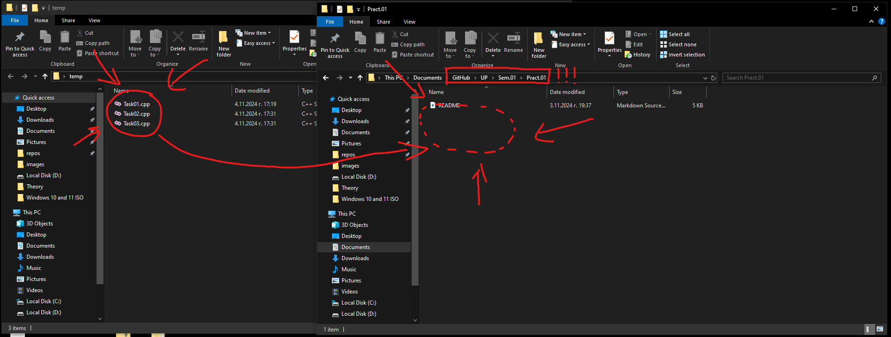
6. Commit-ване на решение на задача
    - При връщане обратно в GitHub Desktop ще забележите в ляво **Changes X** и отдолу списък на промените.

      
    - Изберете само първия файл, а останалите оставете немаркирани. (Както е показано на картината)

      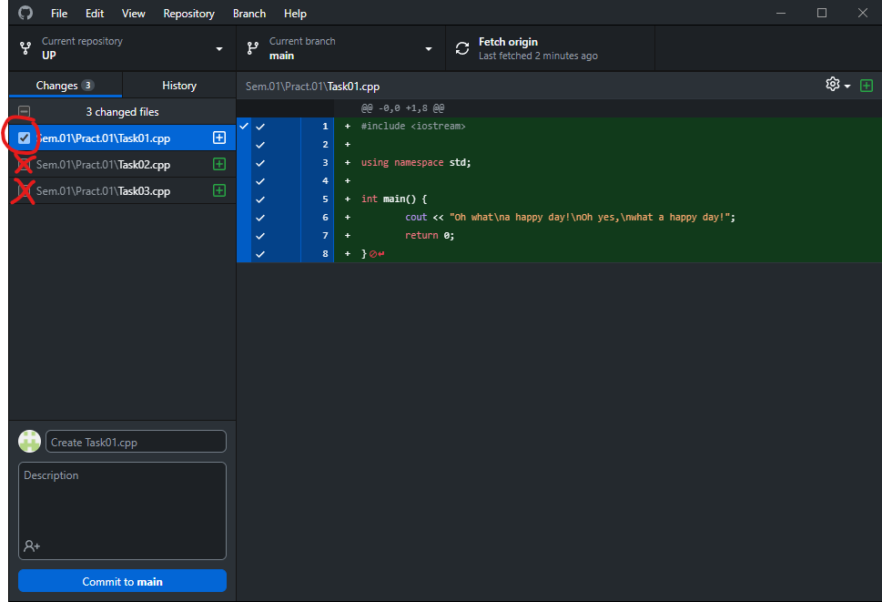
    - Натиснете **Commit to Pract.XX**. (В картината пише **main**, но при вас трябва да пише **Pract.XX**)
    - Повторете тази стъпка за всеки един Task.

      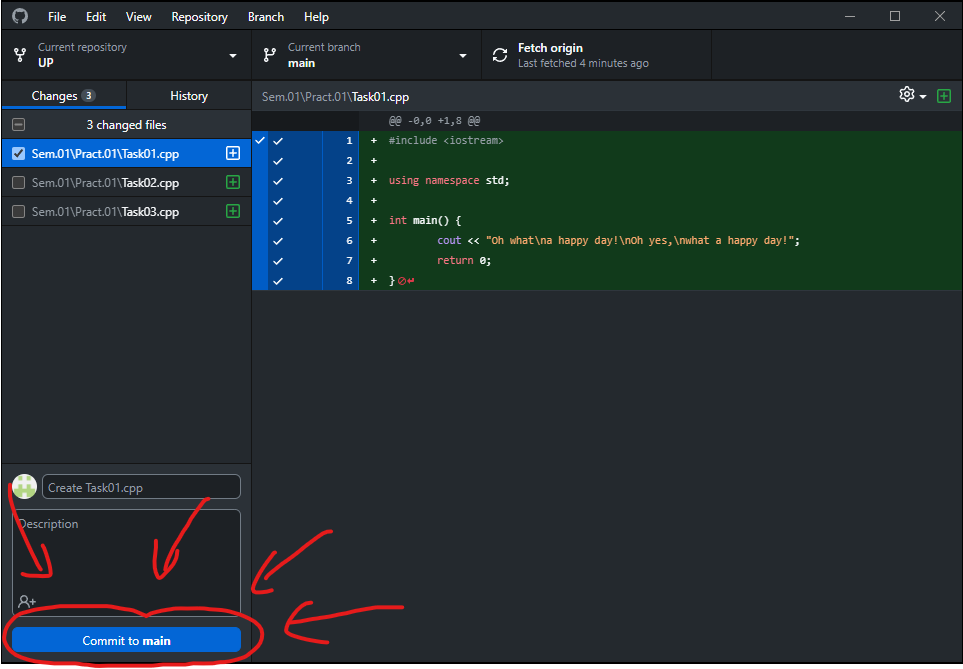
    - Когато приключите с commit-ването на всички решения трябва да ги **Push**-нете, за да могат да бъзат зачетени като промени в GitHub, а не само локално.

      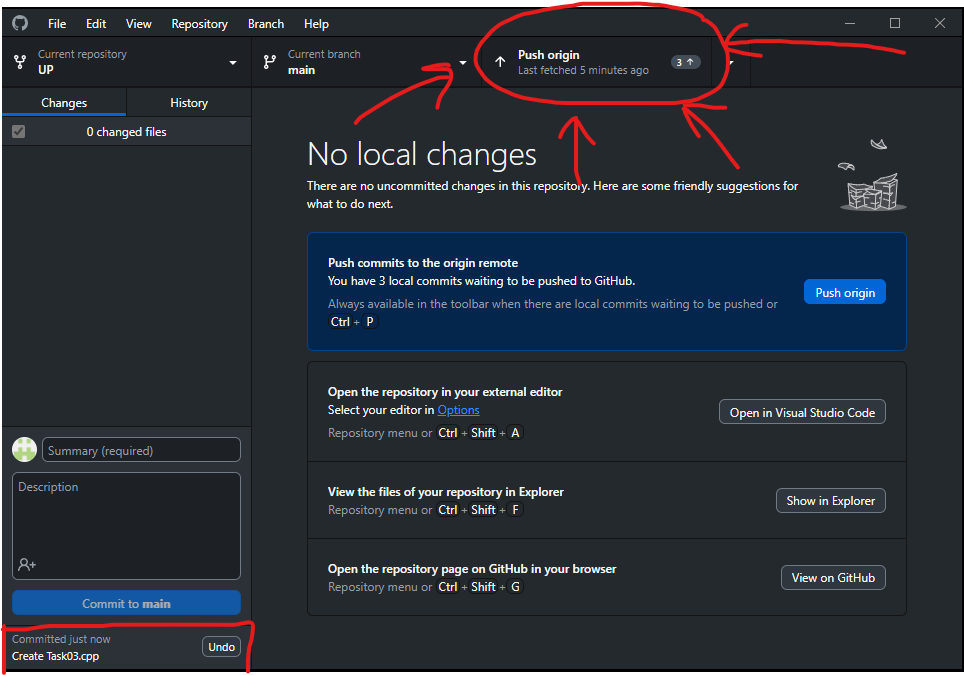
7. Отваряне на Pull Request
    - След като **Push**-нете трябва да направите **Pull Request**.

      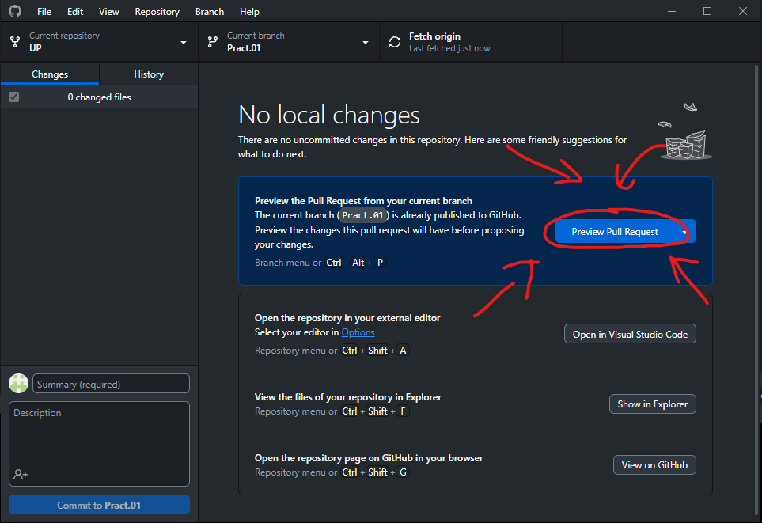
      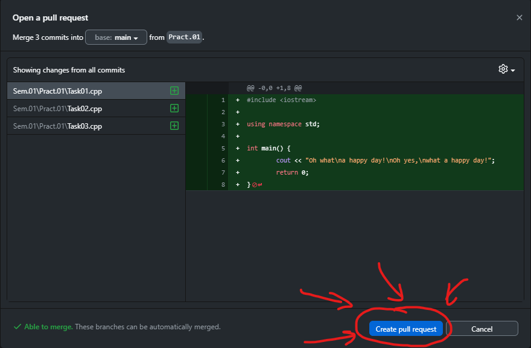
    - След като бъдете препратени към GitHub страницана в браузъра не забравяйте да сложите правилното заглавие и описание на самия Pull Request преди да го пуснете към нас.
    - **Заглавието на Pull Request-а трябва да бъде:**
        ```
        Pract.\<number\>: Add \<first task number\> - \<last task number\> | \<name\>
        
        Example:
        Pract.03: Add 01-03 | John Doe
        ```
    - **Описанието на Pull Request-а трябва да бъде:**
      ```
      \<name\> \<lastname\>
      \<group\> \<fn\>
      
      Example:
      John Doe 
      2 2MI0600192
      ```
      | :boom: **DANGER**|
      |:-----------------|
      | ***If a pull request has more than 3 tasks or the title or description is not in the format described above, the PR will be rejected and not reviewed.***|
    - След като се уверите, че заглавието и описанието на Pull Request-а са правилни, го пускайте към нас и очаквайте обратна връзка скоро! 😎

      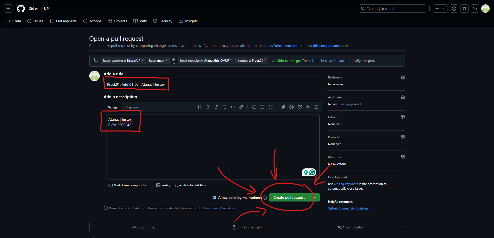
