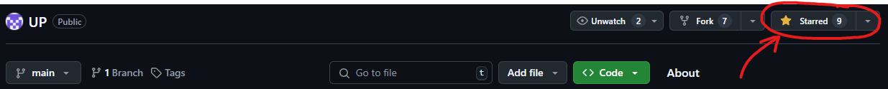

## In Summary

0. Star the repository


1. Fork the repository
    - [How to fork a repository.](https://docs.github.com/en/get-started/quickstart/fork-a-repo)

2. Clone the repository on your local machine
    - [How to clone a repository.](https://docs.github.com/en/repositories/creating-and-managing-repositories/cloning-a-repository)

3. Fetch origin

4. Create a branch 
    - You should create a branch for each **practicum**.
    - The branch should be created from the master branch of the original repository. In this way, you will always have the latest changes.
    - [About branches.](https://docs.github.com/en/pull-requests/collaborating-with-pull-requests/proposing-changes-to-your-work-with-pull-requests/about-branches)
    - [How to create a branch.](https://docs.github.com/en/desktop/contributing-and-collaborating-using-github-desktop/making-changes-in-a-branch/managing-branches#creating-a-branch)

5. Add a solution for a task
    - Create a cpp file for each task.
    - **The file name should be TaskXX.cpp where XX is the task number**<br> e.g. Task01.cpp, Task12.cpp etc. 
    - Copy your solution into the file.
    - Solutions should be in the following directory: **Sem.XX/Pract.XX/Student's Solutions/\<First Name\> \<Family Name\>/** where XX is the practicum number.

6. Commit a solution to a task
    - Commit the file for the task.
    - **Each task should be in a separate commit.**
    - Repeat steps 5. and 6. until you have 3 tasks committed.
    - [About commits.](https://docs.github.com/en/desktop/contributing-and-collaborating-using-github-desktop/making-changes-in-a-branch/committing-and-reviewing-changes-to-your-project#about-commits)

7. Open PR to the original repository to the master branch
    - [How to create a pull request.](https://docs.github.com/en/pull-requests/collaborating-with-pull-requests/proposing-changes-to-your-work-with-pull-requests/creating-a-pull-request)
    - The pull request should request to merge the changes of your branch in the fork to the master branch of the original repositor.
    - **The title of the Pull Request should be:**
        ```
        Pract.\<number\>: Add \<first task number\> - \<last task number\> | \<name\>
        
        Example:
        Pract.03: Add 01-03 | John Doe
        ```
    - **The description of the pull Request should be**
        ```
        \<name\> \<lastname\>
        \<group\> \<fn\>

        Example:
        John Doe 
        2 2MI0600192
        ```


| :boom: **DANGER**|
|:-----------------|
| ***If a pull request has more than 3 tasks or the title or description is not in the format described above, the PR will be rejected and not reviewed.***|
